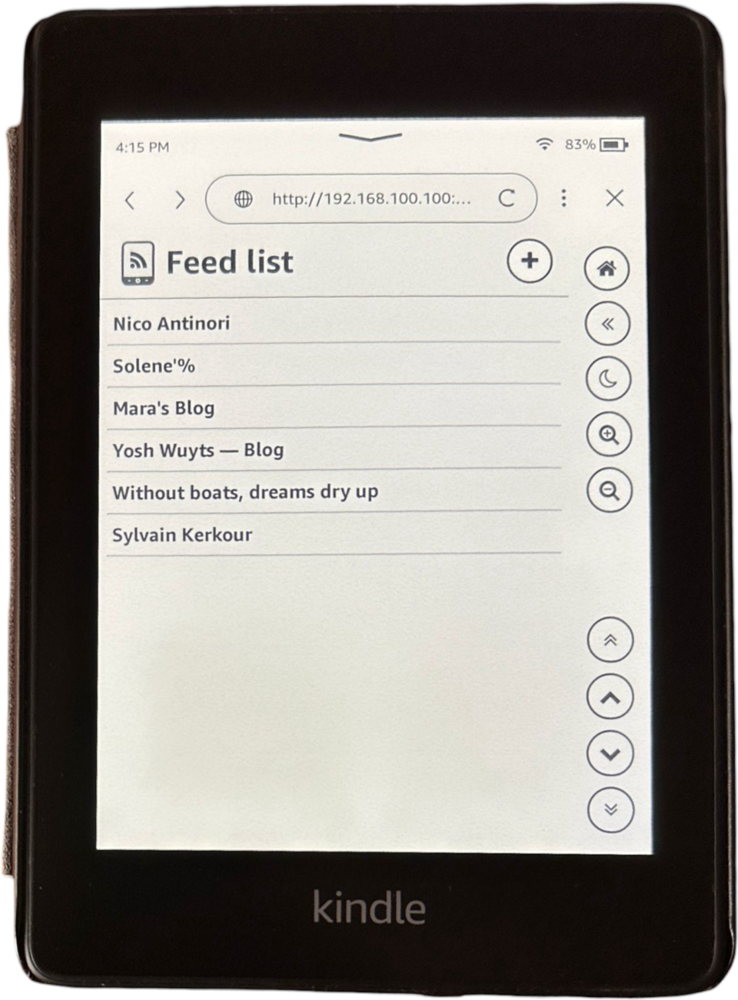
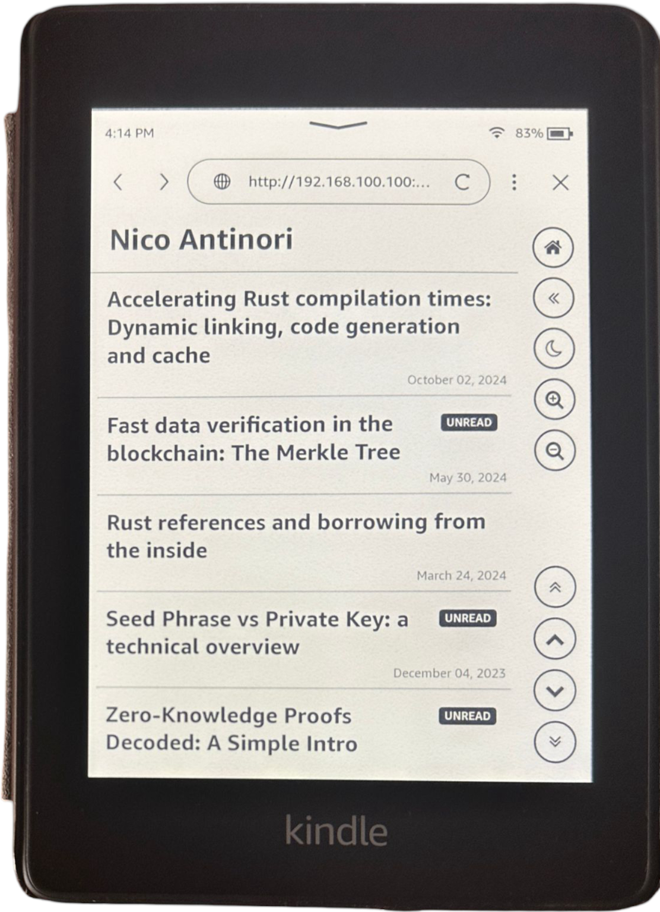
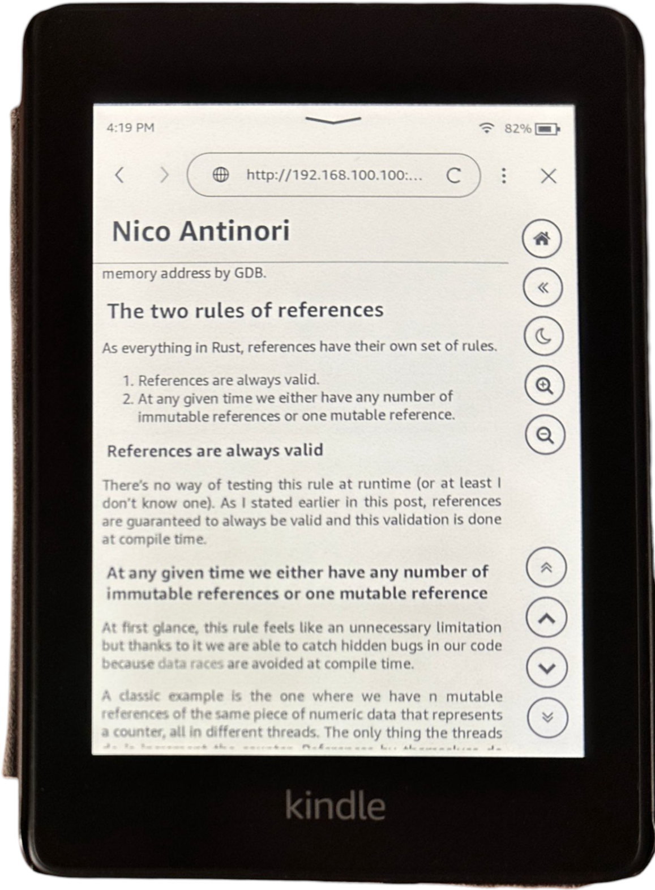
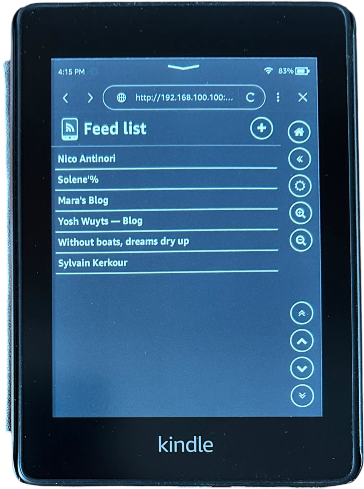
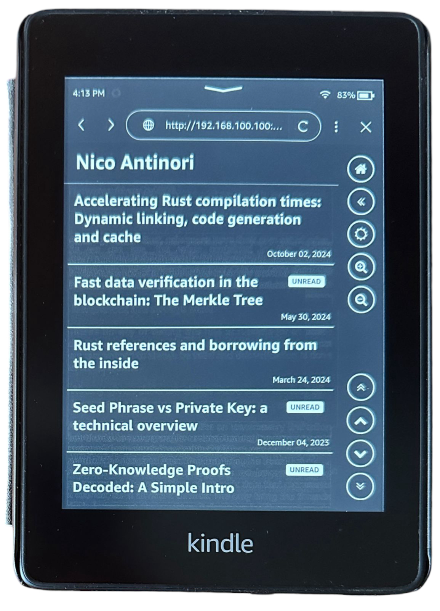
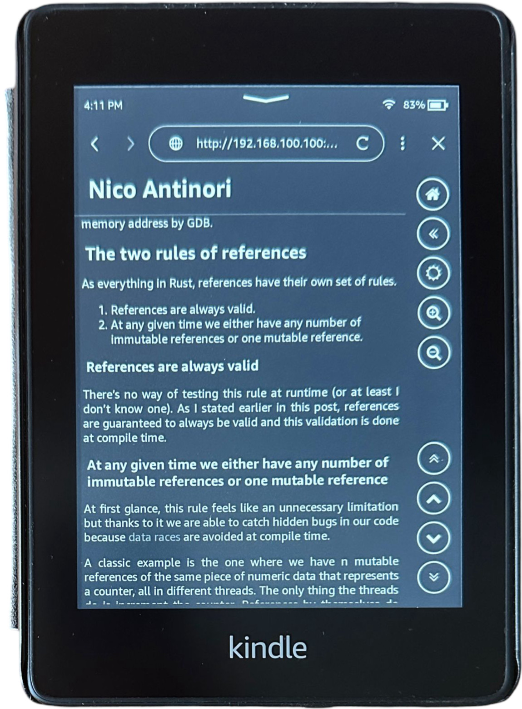

<p align="center">
  
  
  <br>
  <strong>Feed Aggregator for e-ink devices</strong>
</p>


Kindly RSS Reader is a self-hosted feed aggregator (supporting both RSS and Atom feeds) designed for e-ink devices such as Kindle and optimized for low-end computers like the Raspberry Pi.

Feel free to test it, report issues, or contribute by submitting pull requests with new features.

> **Note:** This project is in its early development stages.

## Features
- Fetch and aggregate RSS and Atom feeds.
- Optimized for e-ink display readability.
- Self-hostable on low-end hardware.

## Running the application

### Configuration: Environment variables

The following environment variables are used to configure some aspects of the app:

- `MAX_ARTICLES_QTY_TO_DOWNLOAD`: When adding a new feed, downloads the specified number of articles from newest to oldest. Additional articles will be fetched on demand. If not specified, all articles will be downloaded.

    *Default value: `0`*

- `DATA_PATH`: Path for storing the app data, such as fetched articles, config and the database file.

    *Default value: `.`*

    **Note**: Do not modify this when running it in docker.

- `STATIC_DATA_PATH`: Path where static folders are located (`migrations`, `static` and `templates`).

    *Default value: `.`*

    **Note**: Do not modify this when running it in docker.

- `RUST_LOG`: Configure log level:
  - `TRACE`
  - `DEBUG`
  - `INFO` *default*
  - `WARN`
  - `ERROR`


### Docker

#### Using curl

You can just execute this command:
```bash
curl --proto '=https' --tlsv1.2 -sSf https://raw.githubusercontent.com/nicoan/kindly-rss-reader/refs/heads/main/install_docker.sh | sh
```

#### Manually

At the moment only a docker image is supported. To run the project:

1. Make a new directory to save the container data:
    ```bash
    mkdir -p ./kindly-rss-data/data
    ```

    This directory will be used as volume to persist the the app data in the host. This is useful for not losing data when running a new docker image containing a new version of the app.

2. Pull the latest docker image:
    ```bash
    docker pull nicoan/kindly-rss-reader
    ```

3. Run the docker image:
    ```bash
    docker run \
        -d \
        -p 3000:3000 \
        -v "$(pwd)/kindly-rss-data/data:/home/data" \
        --name kindly-rss \
        nicoan/kindly-rss-reader
    ```

    **Note**: If you wish to modify some enviroment variable value, add `-e VAR_NAME=<value>` to the `docker run ...` command.

4. Open your browser and navigate to the app with the address `http:://<ip_of_device_running_the_docker_image>:3000`. I *highly* recommend to add feeds from a computer.

5. Enjoy :).

## Running the Project for development

### Using Cargo

You can run the project with:

```bash
cargo run
```


### Using Docker

1. Build the Docker image:

   ```bash
   docker build --tag kindly-rss .
   ```

2. Run the container:

   ```bash
   docker run --rm -p 3000:3000 kindly-rss
   ```

## Showroom

Here are some screenshots of the Kindly RSS Reader in action:

### Light theme

<p align="center">
  
  
  
</p>


### Dark theme
<p align="center">
  
  
  
</p>

