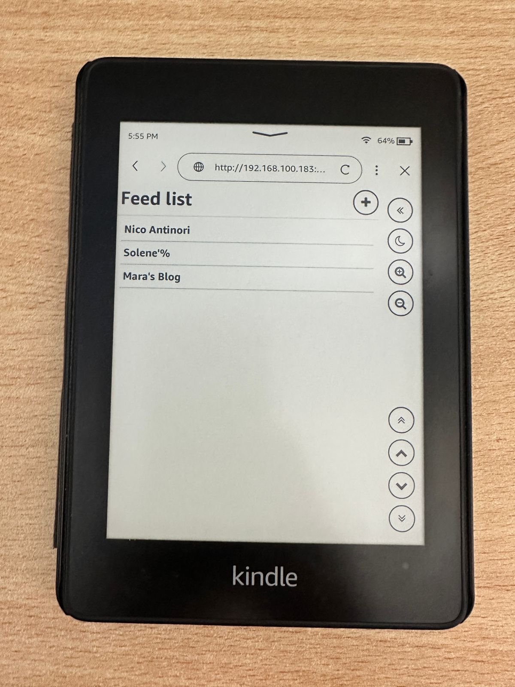
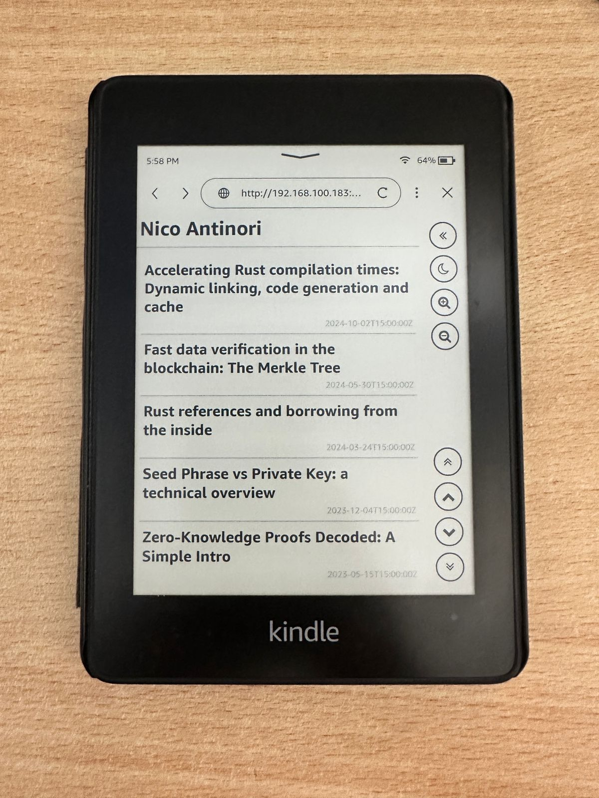
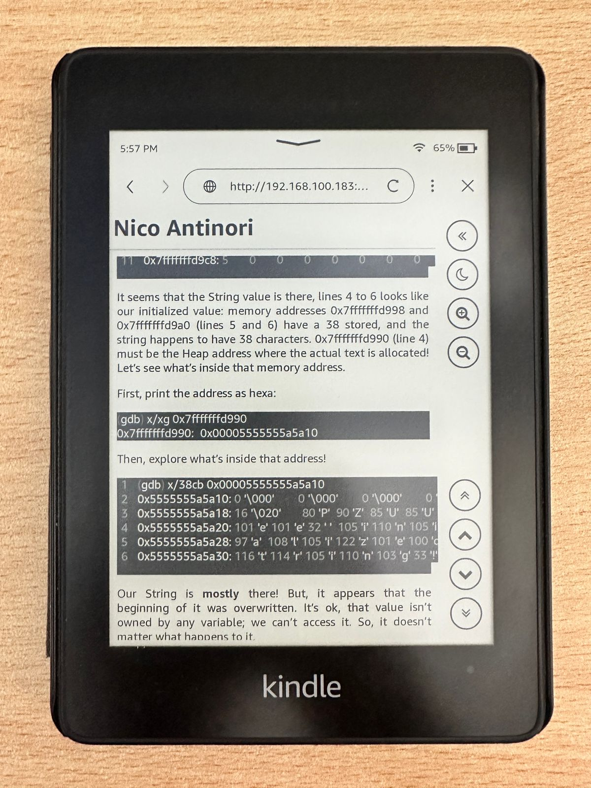

# Kindly RSS Reader

Kindly RSS Reader is a self-hosted RSS aggregator designed to be used in e-ink devices such as Kindle and to be self-hosted in low-end computers such as a Raspberry Pi.

Feel free to test it and/or collaborating creating issues or creating a PR with new features.

**This project is in the very early stages of development**

# Running the project

## cargo

To run the project, you just need to write

```bash
DATA_PATH=. STATIC_DATA_PATH=. cargo run
```

## Docker

1. First build the image with:

```bash
docker build --tag kindly-rss .
```

2. Then run it with

```
docker run -p 3000:3000 kindly-rss
```

## Showroom




